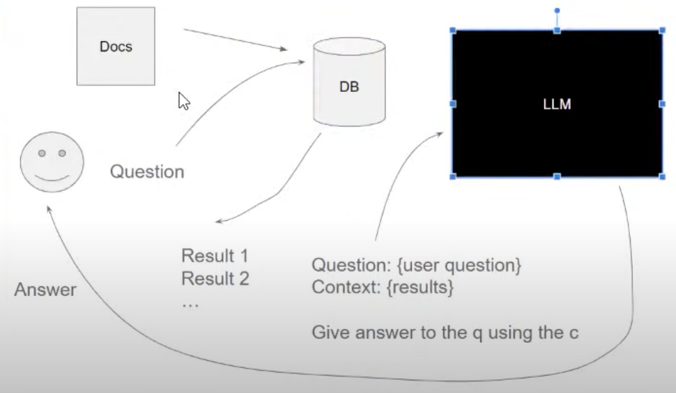

# Workshop 0

Link: https://www.youtube.com/watch?v=q-p36Ak6YI8
Github: https://github.com/alexeygrigorev/llm-rag-workshop/blob/main/README.md

## LLM

Normal LLM:

- Text -> LLM -> Next token/text

  - Example: "How are" -> "you"

- Can view LLM as blackbox that given some prompts (input), it can generate a response (output)

## RAG

- RAG: Retrieval-Augmented Generation

  - A prompt like "look up how to fry an onion"
  - GPT will go up the Internet and actually use search engines
  - Then, use the retrieved information to help with generation

- When user has a question:

  - we actually look up the question in a database (GPT look up the index of the whole Internet with Bing for instance)
  - in our case, we can put the questions and answers in our database and use that to look up
  - database will give back some results
  - we then form a prompt with the user question and the context (consisting of results from database) and ask LLM to generate an answer to user question




## Installation

- `docker run hello-world`
- `pip install pipenv`
- `pipenv install tqdm notebook==7.1.2 openai elasticsearch`

`source .env`: Add our environment variables into shell

- we will need openai in our notebook

### Run elasticsearch

```
docker run -it \
    --rm \
    --name elasticsearch \
    -p 9200:9200 \
    -p 9300:9300 \
    -e "discovery.type=single-node" \
    -e "xpack.security.enabled=false" \
    docker.elastic.co/elasticsearch/elasticsearch:8.4.3
```

**Note on elastic search:** By default, elastic search can only search full-text (full word) and cannot search based on semantics

## Compare with fine-tune

With fine-tune, you technically create a new LLM by fine-tuning some previous LLM with your own data.

It's practical when you have a small underlying LLM, then you want to train it for a specific domain (like law documents).

Then, the fine-tuned LLM will be as good as GPT, or even better, but lighter since it only focuses on laws.

But with RAG, you don't retrain/create a new LLM. You simply use context to manipulate the LLM.
